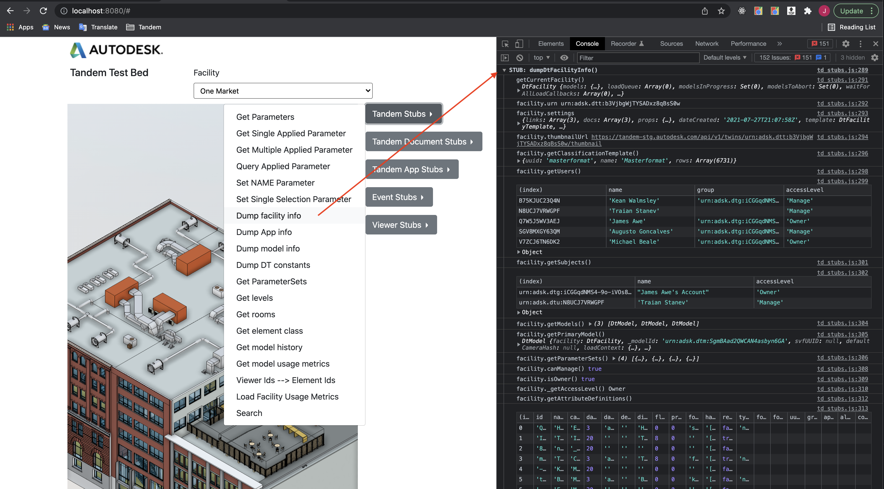
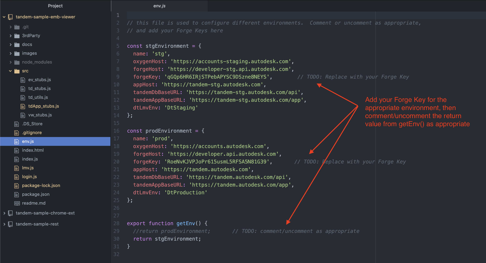
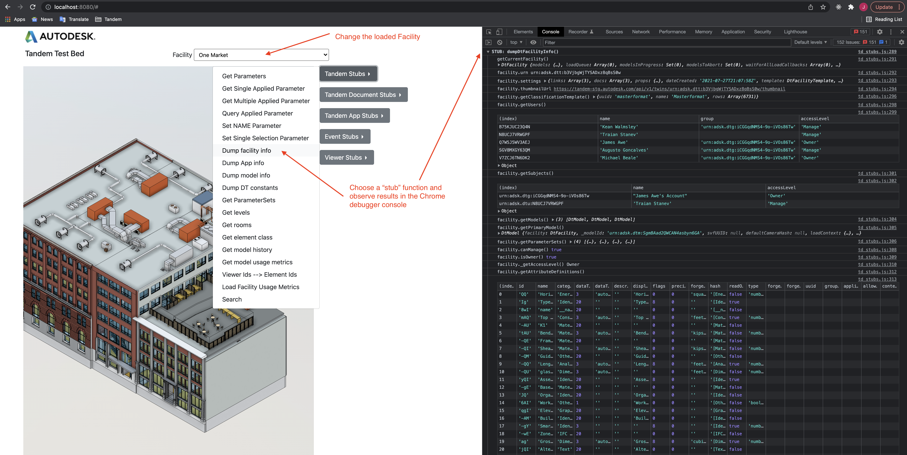
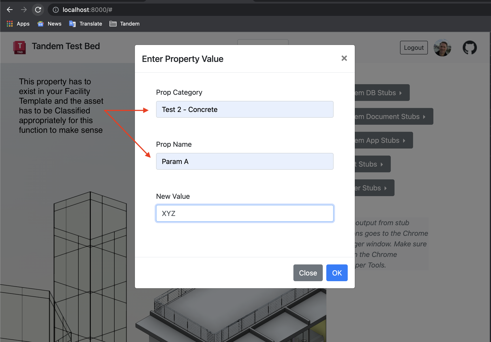

# Tandem Viewer TestBed

## Overview

This sample is a test bed application for exercising the Tandem SDK in an embedded viewer scenario.

It is designed to bring in as few dependencies as possible.  It is plain Javascript and HTML with the exception of jQuery and Bootstrap just to do minimal styling.  The app is designed as simple "Stubs" of functionality that for the most part just dump out results to the Chrome console window.  These interactive tests will surface useful information that you can then use in some of your other code (e.g., URNs for Facilities, Models, etc.). In cases where input is required from the user, the UI is as minimal as possible, or you are expected to change the code itself that supplies that input, or put a breakpoint in the debugger and change the value temporarily.

*NOTE: The Javascript SDK that supports the Embedded Viewer is not yet official. It is an ALPHA version for early preview. This app is not a complete description of the API and is evolving over time as the API evolves.  Any use of this API should be for prototype purposes only.*

## Live Demo

If you just want to run the application without modifying source code, please visit: https://autodesk-tandem.github.io/tandem-sample-emb-viewer/

Login with your Autodesk ID and then choose one of the Facilities you have access to.  If you have not yet used Tandem, you will first need to do the following:
1. Sign up for a free Tandem account: [Tandem signup](https://intandem.autodesk.com/contact-us/?form_type=account#contact-forms)
2. Set up a Facility by importing models and assigning Parameters via Classificaiton: https://tandem.autodesk.com
3. See https://intandem.autodesk.com/resources/ for more information on how to do this.

## Running Locally

If you would like to use the source to debug or extend with your own test stub functions, follow these steps:

1. Clone the repository to your local machine
2. Make sure you have an account and access to at least one facility at https://tandem.autodesk.com
3. Create a new Application on the Forge Developer Portal to get your Client_ID: https://forge.autodesk.com

## Setup and Configuration

1. Add your application Client_ID to the code.  Find the appropriate lines in the file `env.js` as shown in the image below.

2. If you are developing internally at Autodesk, make sure to use the appropriate environment consistently.  Depending on whether you are using STAGING or PRODUCTION (as shown in the image above), set the Viewer to load into the HTML page using the same environment.

## Start App

Start a local server by running `python3 -m http.server` in a terminal window. Then open the Chrome browser and go to http://localhost:8000

Login to your account to get access to your Facilities.  If you don't have any facilities yet, create one using the Tandem product.

## Using the App

Many of the functions will not be interesting until you have setup a Facility with a Template and Classifications.  For example, to set user-defined property data on an asset, like in the following example, that property has to exist in the Facility Template and the asset must have been classified correctly to use it.

*NOTE: if you are testing the REST API using the Postman collection, this Test Bed App is very useful for retrieving URNS, and other information that needs to be supplied to the REST API.*
