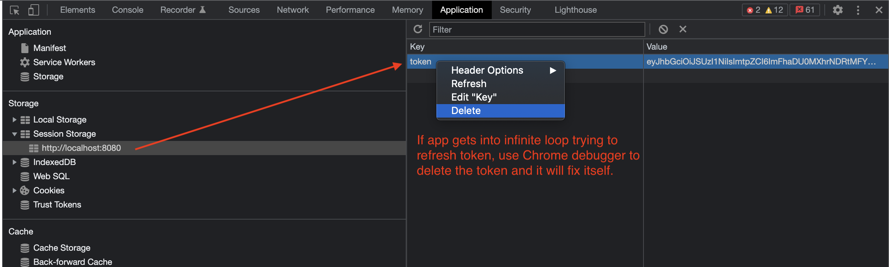
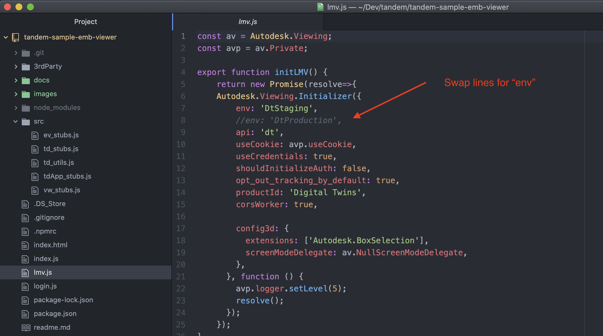
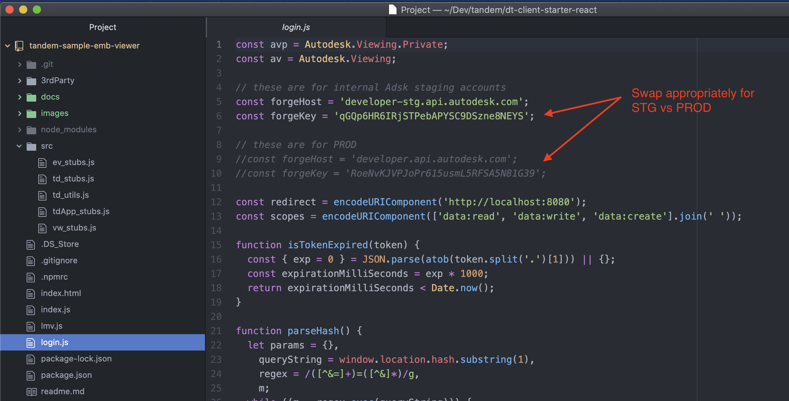

## Tandem Viewer TestBed

A test bed application for exercising the Tandem Viewer in an embedded viewer scenario.

Deals with authentication (Oxygen login) and loading a facility from Autodesk Tandem in vanilla js using the _Tandem SDK_ (@adsk/lmv-double-trouble). Snowpack is used as a development server (which is required for the login redirects).

## Pre-requisites

1. Install npm: https://www.npmjs.com
2. Install snowpack: https://www.snowpack.dev
3. Make sure you have an account and access to at least one facility at https://tandem-stg.autodesk.com (STAGING environment) or at https://tandem.autodesk.com (PRODUCTION environment).

## Setup

After cloning this repo, run `npm install`.

## Start App

To start the development server, run `npm start`. The browser should open for you at http://localhost:8080 and take you to the login first, and then back to your app.

NOTE: token refresh doesn't always work.  If you reload the app and find it in an infinite refresh loop, delete the token as shown in the image below.

## Using the App

The test bed app is designed to bring in as few dependencies as possible.  It is plain Javascript and HTML with the exception of jQuery and Bootstrap just to do minimal styling.  The app is designed as simple "Stubs" of functionality that for the most part just dump out results to the Chrome console window.  These interactive tests will surface useful information that you can then use in some of your other code (e.g., URNs for Facilities, Models, etc.). In cases where input is required from the user, UI is as minimal as possible, or you are expected to change the code itself that supplies that input, or put a breakpoint in the debugger and change the value temporarily.

## Configuring the App for different environments

By default, this sample app uses the STAGING environment for Tandem.  If you would like to use the PRODUCTION environment, modify the following lines of code:

